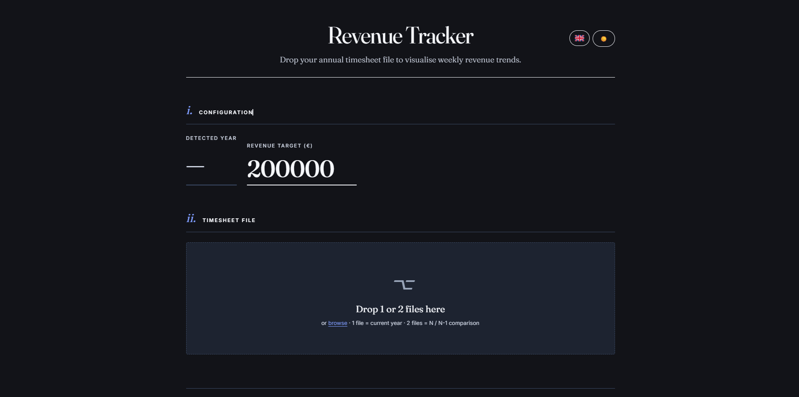

<h1 align="center">
  
</h1>


---

# AnalyseYourCA — Suivi du Chiffre d'Affaires

## Aperçu
Application web **100% client-side** pour analyser un chiffre d'affaires hebdomadaire depuis des fichiers de timesheet Excel. Aucun serveur, aucune installation — glissez votre fichier XLSX, les graphiques s'affichent instantanément. Comparaison N / N-1 supportée.

## Fonctionnalités

### Import & Parsing
- **Glisser-déposer** ou sélection de fichier — formats `.xlsx`, `.xlsm`, `.xls`
- **1 fichier** = analyse de l'année en cours · **2 fichiers** = comparaison N / N-1
- Détection automatique de l'année depuis l'onglet `Years`
- **Détection des noms de feuilles flexible** : numériques purs (`1`, `08`), préfixés (`S1`, `Sem1`, `Semaine 1`, `W03`) ou par position
- Parsing de **3 formats de données** par feuille : TJM/TMA labelisés (`TJM : 925`), numériques directs, ou durée brute sans taux
- **`toNumber()` robuste** : gère les formats français (`1 234,56`), allemand (`1.234,56`), anglais (`1,234.56`) et les espaces Unicode insécables
- **`isYearsSheet()`** : source unique de vérité pour la détection de l'onglet Years — cohérence garantie entre le parsing et le skip de feuille
- Feedback en temps réel (statut de lecture, erreurs, nombre de semaines chargées)

### Calculs & Métriques
- **CA total** et **moyenne hebdomadaire**
- **TJM moyen pondéré** (par jours travaillés) et **TMA moyen pondéré**
- **Meilleure semaine** (CA max)
- **Jours travaillés** cumulés
- **Taux de facturation** : `(jours facturables / jours travaillés hors absences) × 100`
- **Projection annuelle** basée sur la moyenne des semaines facturées
- **Performance mensuelle** : CA réel vs objectif mensuel (annuel ÷ 12) avec ratio et statut succès/échec

### Visualisations (10 graphiques interactifs)
- **CA hebdomadaire** — courbe avec dégradé de remplissage et ligne d'objectif
- **CA cumulé vs Objectif & Projection** — trajectoire réelle, objectif linéaire et projection par extrapolation
- **CA par mois** — barres avec ligne d'objectif mensuel recalculé
- **Jours internes par semaine** — barres empilées absences / jours internes
- **Taux de facturation** — barres colorées (vert / jaune / orange / rouge) en vue semaine, mois ou total
- **Top clients — CA généré** — barres horizontales classées
- **Jours facturables Régie & TMA par mois** — barres empilées par mois
- **Jours passés en Régie par mois et activité** — barres empilées par client
- **Jours passés en TMA par mois et activité** — barres empilées par client
- **Objectifs mensuels — Succès & Échecs** — tableau avec anneaux SVG de ratio

### Interactivité
- **Objectif CA configurable** en direct — tous les graphiques se recalculent instantanément
- **Comparaison N-1** : bouton ⟷ par graphique pour superposer l'année précédente
- **Sections repliables** : chaque graphique peut être masqué/affiché — **rendu différé** (le graphique n'est dessiné que lorsque la section est ouverte)
- **Bascule vue Semaine / Mois** sur les graphiques revenus et facturation
- **Tri des tableaux** par colonne (semaines et clients)
- **Thème clair / sombre** persisté en `localStorage`
- **Langue FR / EN** avec 150+ clés de traduction, persistée en `localStorage`
- **📥 Exporter PDF** : étend toutes les sections et déclenche `window.print()` — CSS `@media print` masque les contrôles

### Fichiers d'exemple
Des timesheets anonymisés sont disponibles dans [`assets/csv/`](./assets/csv/) pour tester l'application sans données personnelles.

### Sécurité
- **SRI (Subresource Integrity)** sur tous les scripts CDN — un CDN compromis ne peut pas injecter de code malveillant
- **Aucune donnée transmise** — tout le traitement reste dans le navigateur, rien n'est envoyé à un serveur

## Technologies
- **HTML / CSS / JavaScript vanilla** — aucun framework, aucune dépendance serveur
- **XLSX.js 0.18.5** (CDN + SRI sha384) — parsing des fichiers Excel dans le navigateur
- **Chart.js 4.4.1** (CDN + SRI sha384) — rendu canvas des 10 graphiques interactifs
- **Google Fonts** — Fraunces (titres) + Inter (texte)
- **CSS Variables** — theming clair/sombre complet sans JavaScript
- **`localStorage`** — persistance des préférences (thème, langue, objectif)

## Utilisation

**Aucune installation nécessaire.** L'application est un fichier HTML unique :

👉 Ouvrir `timesheet-ca.html` dans un navigateur moderne (Chrome, Firefox, Edge, Safari)

1. Renseigner l'**objectif CA annuel** (€)
2. **Glisser-déposer** 1 ou 2 fichiers XLSX de timesheet
3. Explorer les graphiques — modifier l'objectif en direct pour recalculer les projections

> Pour tester sans données personnelles, utiliser les fichiers fournis dans [`assets/csv/`](./assets/csv/)

## Structure du projet

```
AnalyseYourCA/
  timesheet-ca.html        → Application complète (HTML + CSS + JS en un seul fichier)
  assets/
    csv/                   → Timesheets anonymisés pour démonstration
    images/github/         → Images README (header, UI, star)
  README.md
```

## Format du fichier Excel attendu

```
Classeur XLSX
├── Years          → Lookup TJM / TMA par client (détecté automatiquement)
├── 1 (ou S1)      → Semaine 1 : durées, taux, CA par activité
├── 2 (ou S2)      → Semaine 2
└── ...            → Jusqu'à 52 semaines
```

**Structure d'une feuille semaine :**

| Col A | Col B | Col C | Col F | Col G | Col H |
|---|---|---|---|---|---|
| Date | Activité / Client | Type | Durée (j) | Taux (TJM/TMA) | CA |

Les absences (`Congés`, `RTT`, `Absence`) sont détectées via la colonne C et exclues du taux de facturation.

## Requêtes de débogage (console DevTools)

```js
// Inspecter les données de la semaine active
console.table(lastEnriched)

// Vérifier le lookup clients depuis l'onglet Years
console.table(Object.values(allData[lastYear].yearsLookup))

// Afficher les stats calculées
console.log({ totalCA: lastEnriched.reduce((s,w) => s+w.revenue, 0), weeks: lastEnriched.length })

// Tester le parsing d'un nombre
toNumber("1 234,56")   // → 1234.56
toNumber("1.234,56")   // → 1234.56
```

## Aperçu de l'interface


## Auteur
- [Pierre-Portfolio](https://github.com/Pierre-Portfolio/)

---

<p align="center">Projet réalisé en 2026.</p>
